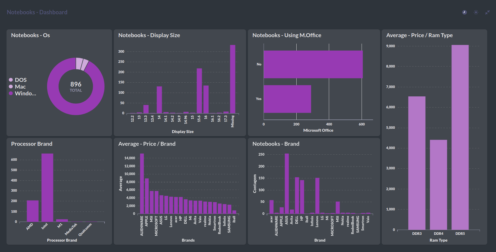

# Sobre o Conjunto de Dados
### Quais Fatores Afetam os Preços de Computadores Portáteis?

    

Diversos fatores influenciam os preços de laptops. Isso inclui a Marca e Opções, ou seja, a marca do laptop e a quantidade de complementos no pacote. O Desempenho e Funcionalidade também conta, como memória e velocidade do processador. Alguns compram com base no visual e design. Marcas tendem a custar mais, muitas vezes devido ao reconhecimento. Garantias melhores são uma vantagem. Mais memória significa melhor desempenho e o tamanho do disco rígido também importa. Drivers de vídeo e dispositivos de gravação afetam os preços. Laptops geralmente vêm com software pré-instalado; mais software costuma significar preço mais alto. Muitos compram pacotes com extras como monitor, teclado e mouse, afetando os preços. Algumas marcas enfatizam estilo e design como ponto de venda, com sistemas elegantes e cores variadas, apelando para quem valoriza a aparência.

### De onde obtive esses dados?
> Obtive esses dados do site [flipkart.com](https://www.flipkart.com/)
> Usei uma ferramenta automatizada de extensão web do Chrome chamada Instant Data Scrapper
> Recomendo muito que você use essa bela ferramenta para obter dados de qualquer lugar na web. É muito fácil de usar e não é necessário ter conhecimento em programação.

### Análises:
* Descritiva e Diagnóstica
